# 🍟 Grand Theft Poutine

**A GTA-like open-world game set in a real, recognizable downtown Montréal — generated from actual map data.**

No missions (yet). The game *is* the city: real street grid, real street names, real landmarks, Mont Royal at real elevation. Walk it, drive it, watch the sun set over the Old Port.

*Working title: MTL — Open Île.*

| | |
|---|---|
| 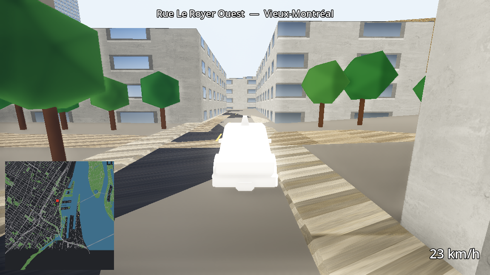 | 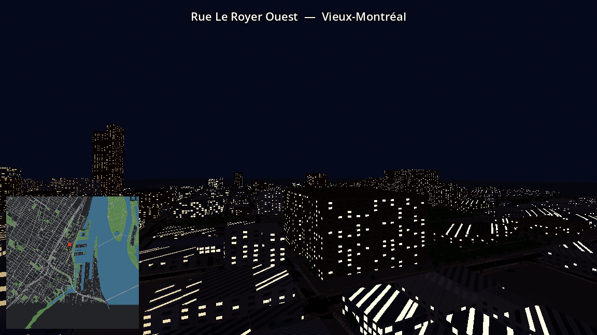 |
| 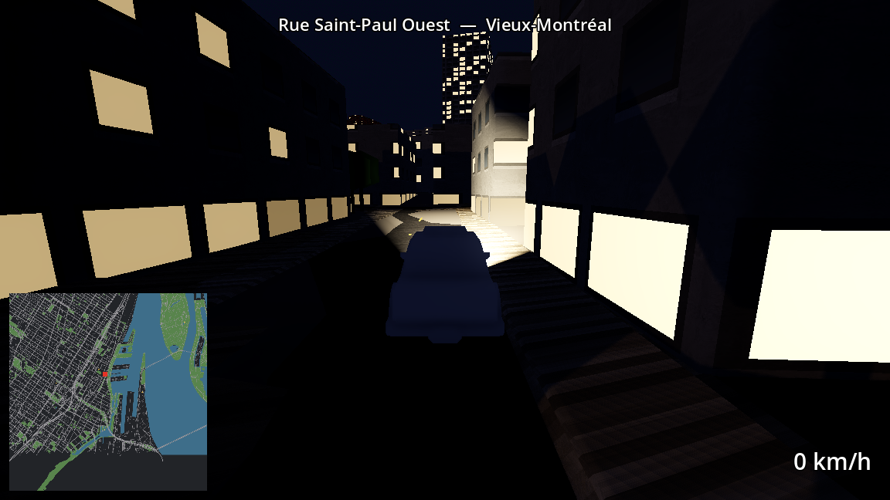 | 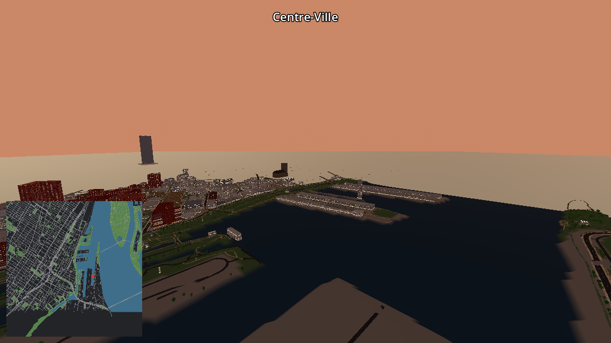 |
| 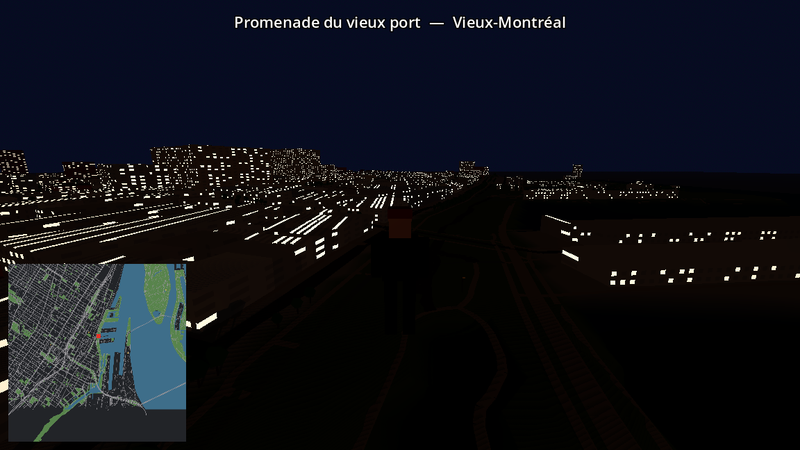 | 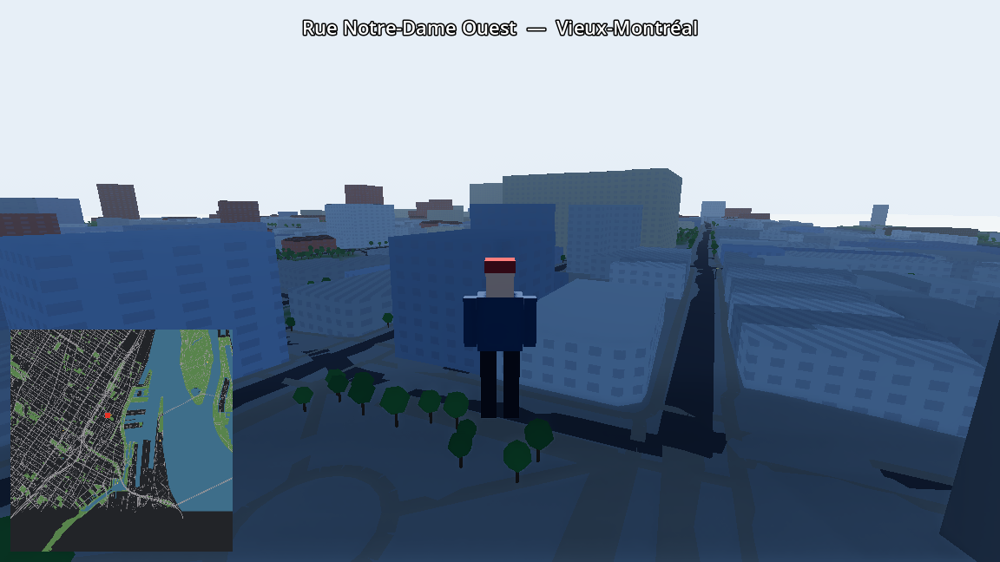 |
| 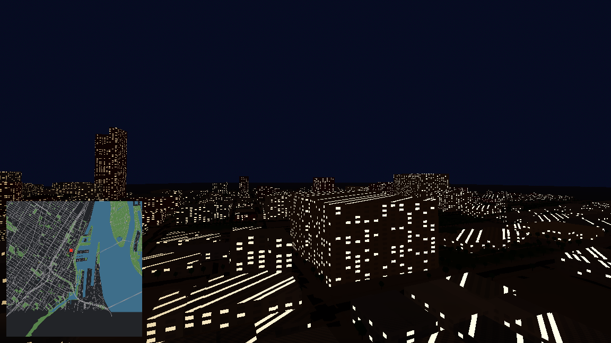 | 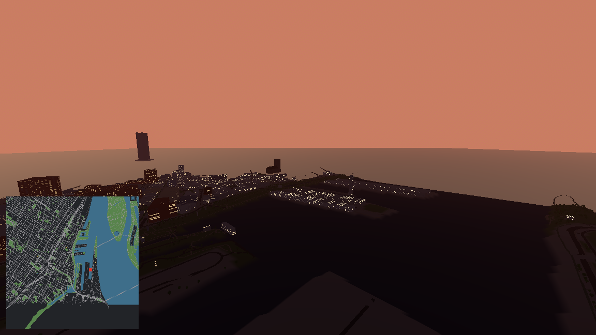 |
| 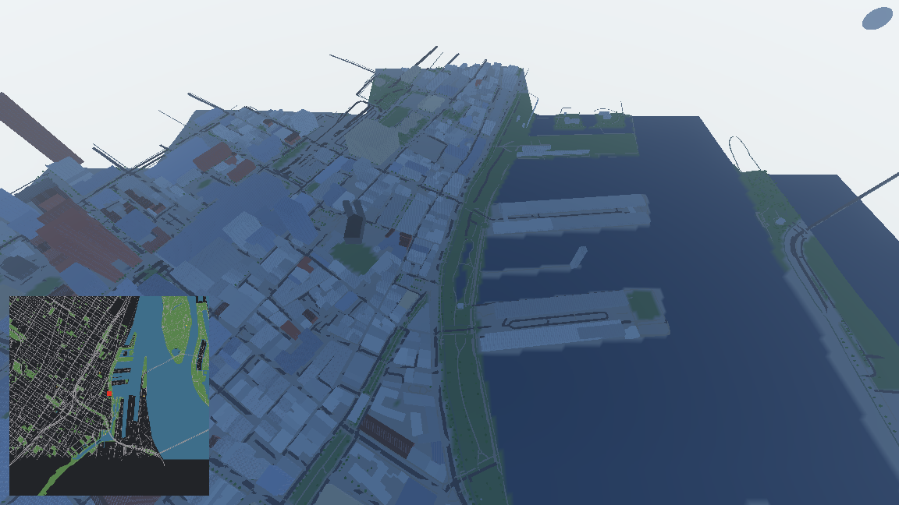 | 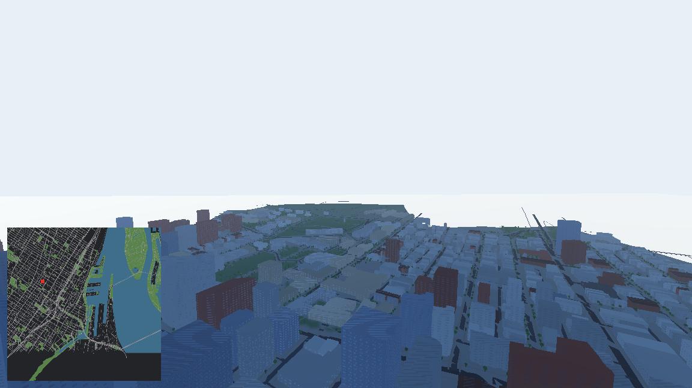 |
| 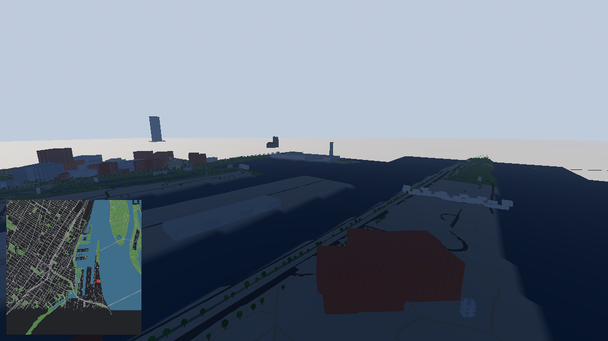 | 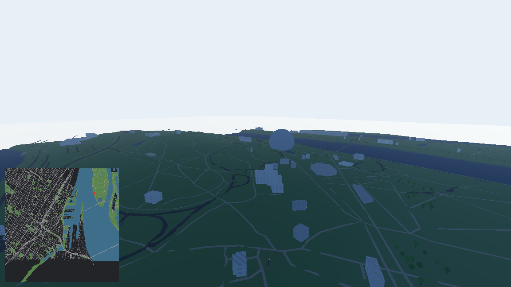 |

## How it works

Two halves, joined by a data contract:

```
OpenStreetMap ──┐
                ├──►  pipeline/  (Python)  ──►  game/world/  ──►  game/  (Godot 4.5)
HRDEM elevation ┘     offline, deterministic     glTF tiles         runtime
```

- **`pipeline/`** — Python. Downloads downtown Montréal from OpenStreetMap (Overpass) and terrain from Canada's HRDEM elevation data, then converts it into 256 m glTF tiles: extruded buildings colored by type (brick residential, glass towers, greystone churches), roads by class, the St. Lawrence assembled from multipolygon relations, and terrain-draped everything. Deterministic — same input, byte-identical output.
- **`game/`** — Godot 4.5. Loads the tiles, distance-culls them, and runs the day/night cycle, minimap, and (soon) the player.
- **Hero landmarks** — Place Ville Marie, Notre-Dame Basilica, the Biosphère, Habitat 67, and the Farine Five Roses sign are procedurally modeled low-poly at their true coordinates.

## Roadmap

- [x] **M1–M2** — Gray city: real street grid + extruded buildings, fly-cam
- [x] **M3** — Make it Montréal: palette, river, Mont Royal terrain, landmarks, day/night, minimap
- [x] **M3.5** — WOW pass: emissive windows at night, 16k street trees & lamps from OSM, procedural sky/SSAO/glow/ACES, animated water, roof caps & gables
- [x] **M4** — On foot: third-person character (blocky minifig with a tuque), lazy trimesh collisions, street + district HUD, spawn downtown (F = debug fly-cam)
- [x] **M5** — Behind the wheel: 120 parked cars on real streets, walk up + **E** to drive (arcade physics, chase cam, speedometer)
- [x] **M6a** — Surfaces: real CC0 textures (brick/stone/concrete facades, asphalt, paving), window frames & storefronts, sidewalks with curbs, lane markings
- [x] **M6b** — Light: warm sun & ambient, thinner fog, pooled street lights, car headlights
- [x] **M6c** — Things: Kenney CC0 car models, traffic lights at real signal positions, credits screen (**C**)
- [ ] **M7** — Polish: audio, tuning

## Run it

1. `py -m venv .venv && .venv/Scripts/pip install -r requirements.txt`
2. [Godot 4.5-stable](https://godotengine.org/download/archive/) portable → `tools/godot/`
3. Generate the city (or use the committed tiles in `game/world/`): `.venv/Scripts/python -m pipeline.build`
4. Open `game/` in Godot and run `scenes/main.tscn` — WASD + mouse to walk, **E** near a parked car to drive, **F** for the debug fly-cam, hold **T** to fast-forward time

Tests: `.venv/Scripts/python -m pytest pipeline -q` and `tools/godot/godot_console.exe --headless --path game --script res://tests/smoke_test.gd`

## Data & licenses

- Map data © [OpenStreetMap](https://www.openstreetmap.org/copyright) contributors (ODbL)
- Terrain: [HRDEM](https://open.canada.ca/data/en/dataset/957782bf-847c-4644-a757-e383c0057995) — Natural Resources Canada (Open Government Licence – Canada)
- Engine: [Godot](https://godotengine.org/) (MIT)

*Poutine not included.*
